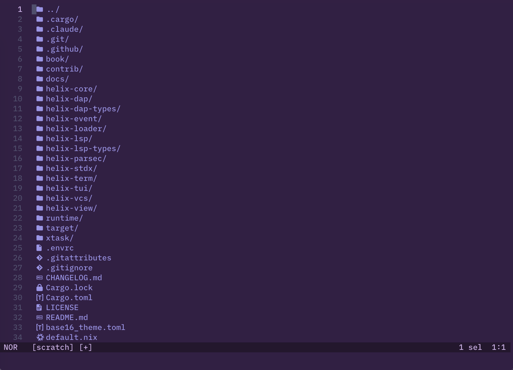

<h1>
<picture>
  <source media="(prefers-color-scheme: dark)" srcset="logo_dark.svg">
  <source media="(prefers-color-scheme: light)" srcset="logo_light.svg">
  
</picture>
</h1>

> **This is a personal fork of [Helix](https://github.com/helix-editor/helix)**
> that adds [oil.nvim](https://github.com/stevearc/oil.nvim)-style directory editing.
> Built with [Claude Code](https://claude.ai/claude-code).

---

A [Kakoune](https://github.com/mawww/kakoune) / [Neovim](https://github.com/neovim/neovim) inspired editor, written in Rust.

The editing model is very heavily based on Kakoune; during development I found
myself agreeing with most of Kakoune's design decisions.

For more information, see the [upstream website](https://helix-editor.com) or
[documentation](https://docs.helix-editor.com/).

All shortcuts/keymaps can be found [in the documentation on the website](https://docs.helix-editor.com/keymap.html).

[Troubleshooting](https://github.com/helix-editor/helix/wiki/Troubleshooting)

# Oil mode (fork addition)

Press `-` in normal mode to open the parent directory of the current file as an
editable buffer. Navigate the filesystem the way you edit text.

| Key | Context | Action |
|-----|---------|--------|
| `-` | Any buffer | Open parent directory as editable buffer |
| `-` | Oil buffer | Go up to parent directory |
| `Enter` | Oil buffer | Open file / enter directory |
| `:w` | Oil buffer | Apply filesystem changes |

**Editing the buffer edits the filesystem:**

- **Rename** a file: edit its name in the buffer
- **Delete** a file: delete its line
- **Create** a file: add a new line with a filename (append `/` for directories)
- **Save** with `:w` to apply all changes at once

This mirrors [oil.nvim](https://github.com/stevearc/oil.nvim) for Neovim.

# Features

- Vim-like modal editing
- Multiple selections
- Built-in language server support
- Smart, incremental syntax highlighting and code editing via tree-sitter

Although it's primarily a terminal-based editor, I am interested in exploring
a custom renderer (similar to Emacs) using wgpu.

Note: Only certain languages have indentation definitions at the moment. Check
`runtime/queries/<lang>/` for `indents.scm`.

# Installation

[Installation documentation](https://docs.helix-editor.com/install.html).

# Contributing

Contributing guidelines can be found [here](./docs/CONTRIBUTING.md).

# Getting help

Your question might already be answered on the [FAQ](https://github.com/helix-editor/helix/wiki/FAQ).

Discuss the project on the community [Matrix Space](https://matrix.to/#/#helix-community:matrix.org) (make sure to join `#helix-editor:matrix.org` if you're on a client that doesn't support Matrix Spaces yet).

# Credits

Thanks to [@jakenvac](https://github.com/jakenvac) for designing the logo!
